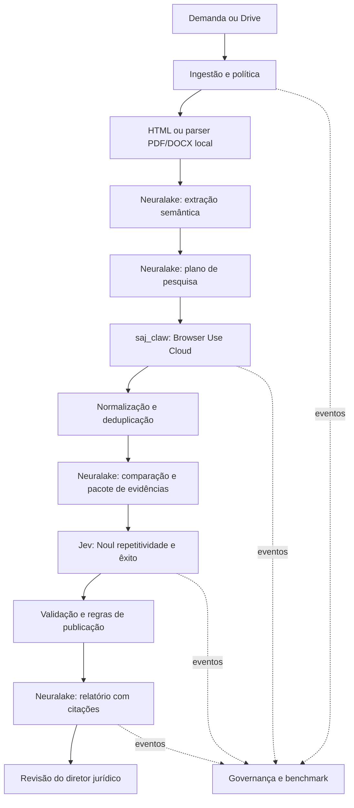

# 02 — Arquitetura, agentes e execução

## Decisão para o MVP

Python 3.11+, FastAPI/Pydantic, cliente HTTP assíncrono, SQLite WAL e filesystem. Dois processos: API e worker. Não usar apenas tarefas de background do servidor web: um restart não pode apagar uma pesquisa em andamento. Um worker inicialmente e concorrência 1 para Browser Use. SQLite guarda jobs/checkpoints e o índice do cache; um lease com expiração permite recuperação. Migrar para Postgres/fila dedicada quando concorrência ou múltiplas máquinas forem necessárias.

Orquestração por máquina de estados explícita. Agentes são papéis especializados com prompt, entradas e ferramentas delimitadas; não exigem modelos diferentes ou infraestrutura separada. Subagentes opcionais analisam documentos/decisões em paralelo com limite de concorrência. O pai consolida saídas tipadas, nunca conversas inteiras. Sem autorreplicação ou delegação irrestrita.

## Processos e contratos

| Etapa | Responsável | Entrada → saída | Critério de saída |
|---|---|---|---|
| ingest | `legal_intake` + `drive_claw`/upload | CaseInput → DocumentArtifact[] | tipo/tamanho/hash válidos |
| parse | `document_parser` / CPU local | bytes/HTML → ParsedDocument | texto por página/bloco, cobertura e falhas explícitas |
| extract | `intake_agent` / Neuralake text | textos paginados → CaseProfile | schema + referências |
| plan | `research_agent` / Neuralake text | CaseProfile → ResearchPlan | filtros e destino autorizados |
| collect | `judicial_research` / `saj_claw` | ResearchPlan → Evidence[] | URLs/trechos/artefatos verificáveis |
| normalize | código determinístico | Evidence[] → corpus único | duplicatas agrupadas |
| compare | `evidence_agent` / Neuralake | perfil + candidatos → ComparativeAssessment[] | razões + diferenças citadas |
| consolidate | código + síntese Neuralake | comparações → EvidencePack | orçamento de contexto respeitado |
| decide | `decision` / Jev | EvidencePack → RawDecision | Noul válido; versão guardada |
| validate | código + governance | RawDecision → AnalysisResult | política de abstenção aplicada |
| report | `report_agent` / Neuralake | AnalysisResult + EvidencePack → Report | citações/números consistentes |
| review | diretor jurídico | Report → Review | aceitar/corrigir/rejeitar registrado |

## Estado persistente

Run: `queued → running → awaiting_review → completed`. Transições alternativas: `running → blocked|partial|failed|cancel_requested → cancelled`. Step: `pending → running → succeeded|failed|blocked|skipped`. Review encerra run; gerar relatório apenas coloca em `awaiting_review`.

Salvar checkpoint após cada saída validada. Cada artefato é imutável: correção cria nova versão. Dados recebidos durante uma execução não alteram seu snapshot. Uma reanálise cria outro run com referência ao anterior.

### Cache MVP

Não instalar Redis. O único cache ativo é o de parsing: SQLite indexa `tenant_id + sha256 dos bytes + parser + versão + configuração`, e o texto extraído por página fica em arquivo local por hash. Um documento idêntico na segunda/terceira execução retorna o ParsedDocument sem novo parsing e registra `cache_hit=true`, `parse_ms=0` e idade do cache.

Browser Use e Jev não usam cache invisível: pesquisa judicial muda e decisão depende do pacote de evidências. Para repetir sem gastar, usar modo `replay`, que identifica a origem dos artefatos. Cache, replay e live são marcados em cada span. TTL de 24 horas ou limpeza ao encerrar a demonstração.

Idempotência local: `(tenant_id, Idempotency-Key, request_hash)` único. Mesma chave + corpo diferente = 409. Antes de chamada paga, persistir intent; depois persistir ID externo. Timeout após envio pode significar operação aceita: marcar `external_status_unknown`, reconciliar antes de reenviar. Não presumir que o provedor suporta chave idempotente.

Retries: até 2 para leituras idempotentes/transientes; respeitar Retry-After com jitter. 401/403: blocked_config; 402/saldo: blocked_budget; JSON inválido: uma reparação Neuralake, depois partial; 429/5xx: retry controlado. Nenhum fallback silencioso entre live e fixture ou entre Jev e Neuralake.

Cancelamento: parar novas etapas, cancelar run externo quando suportado, encerrar navegador próprio, conciliar custo final. Timeout local não significa cancelamento remoto. Credencial, sessão e workspace externo são recursos distintos.

## Portas de substituição

`InferencePort.generate(messages, schema, budget)`, `DecisionPort.evaluate(state, questions)`, `BrowserPort.start/poll/cancel/close`, `ArtifactStore.put/get`, `EventSink.append`, `OrchestratorPort.enqueue/resume/cancel`.

Runflow pode implementar OrchestratorPort em serviço Node sem alterar contratos. É opcional até confirmar interface pública, persistência, cancelamento e exportação de eventos. Não importar APIs presumidas do SDK. A alternativa local Python mantém o cronograma e facilita futura biblioteca Browser Use local.

## Limites do protótipo

Uma instância privada, um tenant configurado e autenticação token no backend. Token fora do navegador público: front no-code deve usar seu proxy/segredo server-side. Cada consulta ainda filtra tenant_id, mesmo no piloto. Upload máximo proposto 20 MB/100 páginas; tarefa maior retorna erro claro ou segmentação futura. Sem texto utilizável: `unsupported_text_layer`; extração incompleta: `partial_text`. Não executar OCR ou visão para transcrever documentos.

## Desenvolvimento local primeiro

Usar a máquina local com SQLite e diretório `data/` para artefatos. Executar API e worker no mesmo processo no P0, com concorrência 1 para Browser Use. Parsing pode usar subprocesso quando for implementado; iniciar com concorrência 1 e medir CPU/RAM antes de aumentar. Não provisionar infraestrutura nesta fase.

Browser Use permanece Cloud quando entrar no modo live; o parser roda localmente após coleta. Medir custo computacional separadamente de inferência e navegador. Sem GPU ou serviço de OCR. O desenho de deploy só será definido após o benchmark local.
